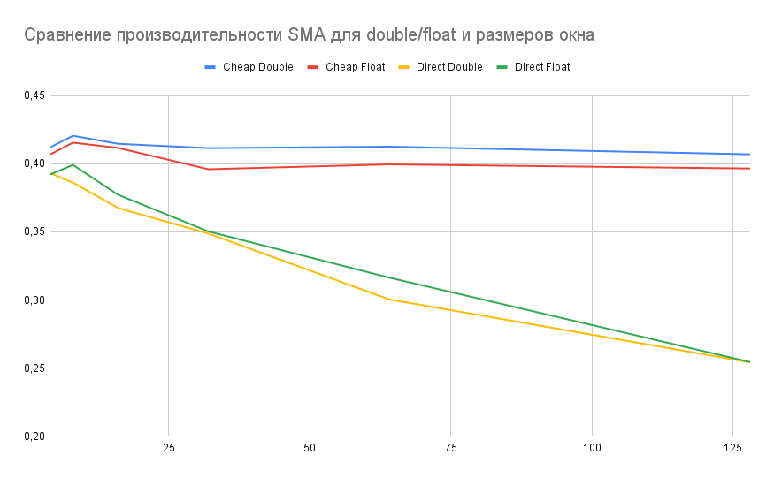

# SimpleMovingAverage
Реализация фильтра простого скользящего среднего (SimpleMovingAverage)

# Описание решения
Разработан шаблонный класс SimpleMovingAverage. В качестве шаблона задается тип значений отсчетов (double, float). Буфер сделан на двусторонней очереди, равной размеру окна фильтрации. Метод <b>getFilteredValue</b> принимает на вход очередное значение измерения и возращает отфильтрованное.

Расчет SMA производится на основе рекуррентной формулы для удешевления арифемтических операций.

Так же реализован метод <b>getFilteredValueSum</b>, который основан на прямой формуле и нужен для сравнения производительности

Программа main через define задает:
- TICKS_NUM - количество отсчетов для тестирования
- TICKS_TYPE - тип данных отсчетов
- WINDOW_SIZE - размер окна фильтра
- MAX_TICK - диазпаон отсчетов от 1 до MAX_TICK
- RANDOM_INPUT - выбор рандомной автоматической генерации или ручной ввод

# Сборка примера
```
mkdir cmake-build-debug
cmake --build cmake-build-debug/
./cmake-build-debug/SMA # executable
```

# Анализ результатов
[Excel с расчетами](https://docs.google.com/spreadsheets/d/1tPm-hv3DktHdAR3nkfoP8BD5N-FAcwC_UbsNL2A4YXE/edit?usp=sharing)

Программа запускалась по 5 раз(затем было проведено усреднение) для каждого размера окна, типа входных и двух вариантов формул. За производительность принята характеристика: <i>количество обрабатываемых отсчетов в миллисекунду.</i> 

По графику видно, что при использовании рекуррентной формулы производительность программы не сильно падает с увеличением окна. Есть небольшая разница при работе с разными типами данных, но графики функций производительности - одного порядка. И программа работает быстрее, чем с использованием прямой формулы.

При использовании прямой формулы расчета SMA производительность программы сильно снижается с увеличением размера окна. Это связано с увеличением объема арифметических операций с дробными числами. 

